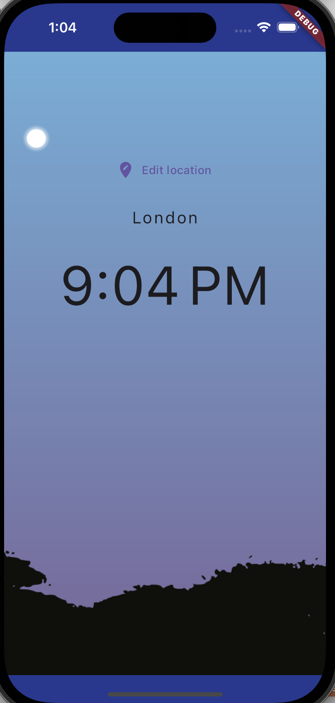

# world_time_flutter

Flutter project to show world cities time.

The code is based on the tutorial from Youtube Channel [Net Ninja](https://www.youtube.com/playlist?list=PL4cUxeGkcC9jLYyp2Aoh6hcWuxFDX6PBJ)

